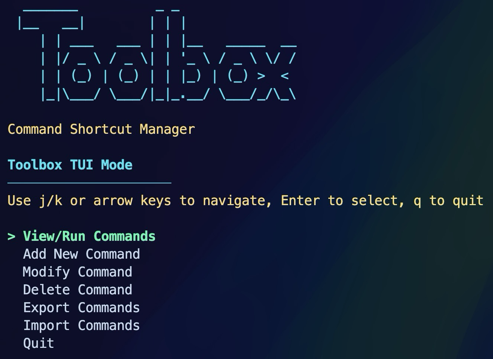

# Toolbox - Terminal Command Manager

<div align="center">
  
  
  <p><strong>Save, organize, and execute your most-used terminal commands</strong></p>
  
  <p>
    <a href="#features">Features</a> •
    <a href="#installation">Installation</a> •
    <a href="#usage">Usage</a> •
    <a href="#screenshots">Screenshots</a> •
    <a href="#configuration">Configuration</a>
  </p>
</div>

## Overview

Toolbox is a powerful terminal utility that helps you save and organize your frequently used commands. Stop wasting time trying to remember or searching your shell history for that complex command you use occasionally.

With Toolbox, you can:
- Store commands with descriptions and categories
- Browse and filter commands by category
- Run commands directly from a user-friendly TUI (Terminal User Interface)
- Import and export command collections to share with others

## Features

- **<svg xmlns="http://www.w3.org/2000/svg" width="16" height="16" fill="none" viewBox="0 0 24 24" stroke-width="1.5" stroke="currentColor"><path stroke-linecap="round" stroke-linejoin="round" d="M16.862 4.487l1.687-1.688a1.875 1.875 0 112.652 2.652L10.582 16.07a4.5 4.5 0 01-1.897 1.13L6 18l.8-2.685a4.5 4.5 0 011.13-1.897l8.932-8.931zm0 0L19.5 7.125M18 14v4.75A2.25 2.25 0 0115.75 21H5.25A2.25 2.25 0 013 18.75V8.25A2.25 2.25 0 015.25 6H10" /></svg> Easy Command Management**: Add, modify, and delete commands with simple syntax
- **<svg xmlns="http://www.w3.org/2000/svg" width="16" height="16" fill="none" viewBox="0 0 24 24" stroke-width="1.5" stroke="currentColor"><path stroke-linecap="round" stroke-linejoin="round" d="M2.25 12.75V12A2.25 2.25 0 014.5 9.75h15A2.25 2.25 0 0121.75 12v.75m-8.69-6.44l-2.12-2.12a1.5 1.5 0 00-1.061-.44H4.5A2.25 2.25 0 002.25 6v12a2.25 2.25 0 002.25 2.25h15A2.25 2.25 0 0021.75 18V9a2.25 2.25 0 00-2.25-2.25h-5.379a1.5 1.5 0 01-1.06-.44z" /></svg> Category Organization**: Group commands by categories for better organization
- **<svg xmlns="http://www.w3.org/2000/svg" width="16" height="16" fill="none" viewBox="0 0 24 24" stroke-width="1.5" stroke="currentColor"><path stroke-linecap="round" stroke-linejoin="round" d="M21 21l-5.197-5.197m0 0A7.5 7.5 0 105.196 5.196a7.5 7.5 0 0010.607 10.607z" /></svg> Search Functionality**: Quickly find commands by name or description
- **<svg xmlns="http://www.w3.org/2000/svg" width="16" height="16" fill="none" viewBox="0 0 24 24" stroke-width="1.5" stroke="currentColor"><path stroke-linecap="round" stroke-linejoin="round" d="M9 17.25v1.007a3 3 0 01-.879 2.122L7.5 21h9l-.621-.621A3 3 0 0115 18.257V17.25m6-12V15a2.25 2.25 0 01-2.25 2.25H5.25A2.25 2.25 0 013 15V5.25m18 0A2.25 2.25 0 0018.75 3H5.25A2.25 2.25 0 003 5.25m18 0V12a2.25 2.25 0 01-2.25 2.25H5.25A2.25 2.25 0 013 12V5.25" /></svg> Interactive TUI Mode**: Full-screen terminal interface with vim-like navigation
- **<svg xmlns="http://www.w3.org/2000/svg" width="16" height="16" fill="none" viewBox="0 0 24 24" stroke-width="1.5" stroke="currentColor"><path stroke-linecap="round" stroke-linejoin="round" d="M3 16.5v2.25A2.25 2.25 0 005.25 21h13.5A2.25 2.25 0 0021 18.75V16.5m-13.5-9L12 3m0 0l4.5 4.5M12 3v13.5" /></svg> Export/Import**: Share your command collections with others
- **<svg xmlns="http://www.w3.org/2000/svg" width="16" height="16" fill="none" viewBox="0 0 24 24" stroke-width="1.5" stroke="currentColor"><path stroke-linecap="round" stroke-linejoin="round" d="M7.5 8.25h9m-9 3H12m-9.75 1.51c0 1.6 1.123 2.994 2.707 3.227 1.129.166 2.27.293 3.423.379.35.026.67.21.865.501L12 21l2.755-4.133a1.14 1.14 0 01.865-.501 48.172 48.172 0 003.423-.379c1.584-.233 2.707-1.626 2.707-3.228V6.741c0-1.602-1.123-2.995-2.707-3.228A48.394 48.394 0 0012 3c-2.392 0-4.744.175-7.043.513C3.373 3.746 2.25 5.14 2.25 6.741v6.018z" /></svg> Vim-style Navigation**: Familiar keybindings for efficient keyboard navigation

## Installation

### Prerequisites

Toolbox requires:
- Bash shell (tested with zsh)
- [jq](https://stedolan.github.io/jq/) for JSON processing
- [fzf](https://github.com/junegunn/fzf) (optional, enhances TUI experience)

### Quick Install

```bash
# Clone the repository
git clone https://github.com/lucolvin/Toolbox_TUI.git

# Make the script executable
chmod +x Toolbox_TUI/toolbox.sh

# Create a symlink (optional, for easier access)
ln -s "$(pwd)/Toolbox_TUI/toolbox.sh" /usr/local/bin/toolbox
```

## Usage

### TUI Mode (Recommended)

The easiest way to use Toolbox is through its Terminal User Interface:

```bash
toolbox
```

Navigate with:
- `j`/`k` or arrow keys: Move up/down
- `Enter`: Select
- `q` or `Esc`: Back/Exit

### Command Line Usage

```bash
# Add a new command
toolbox add list-ports "lsof -i -P -n | grep LISTEN" -d "List all listening ports" -c "network"

# List all commands
toolbox list

# List commands in a specific category
toolbox list -c network

# Run a command
toolbox run list-ports

# Delete a command
toolbox delete list-ports
```

### Command Reference

| Command | Description |
|---------|-------------|
| `toolbox` | Start full-screen terminal user interface |
| `add NAME COMMAND [-d DESCRIPTION] [-c CATEGORY]` | Add a new command shortcut |
| `list [-c CATEGORY] [-s SEARCH]` | List saved commands |
| `run NAME` | Run a saved command |
| `delete NAME` | Delete a command |
| `modify NAME [-cmd COMMAND] [-d DESCRIPTION] [-c CATEGORY]` | Modify an existing command |
| `categories` | List all available categories |
| `export [FILENAME] [-c CATEGORY]` | Export commands to a file |
| `import FILENAME` | Import commands from a file |
| `help` | Show help message |

## Screenshots

<div align="center">
  
  <p><em>TUI Mode - Main Menu</em></p>
  
  
  <p><em>Browsing Commands</em></p>
</div>

## Configuration

Toolbox stores its configuration and command database in `~/.toolbox/`:

- `~/.toolbox/commands.json`: The command database
- `~/.toolbox/exports/`: Directory for exported command collections

## Advanced Usage

### Categories

Organize your commands with categories:

```bash
# List all categories
toolbox categories

# Add a command to a specific category
toolbox add ssh-server "ssh user@server.example.com" -c "servers"

# List only commands in a specific category
toolbox list -c servers
```

### Exporting and Importing

Share your command collection with others:

```bash
# Export all commands
toolbox export my_commands

# Export only commands in a specific category
toolbox export network_commands -c network

# Import commands from a file
toolbox import my_commands.json
```

## License

This project is licensed under the MIT License - see the [LICENSE](LICENSE) for details.

## Contributing

Contributions are welcome! Please feel free to submit a Pull Request.

---

<div align="center">
  <p>Made with ❤️ by Luke's Labs</p>
</div>
